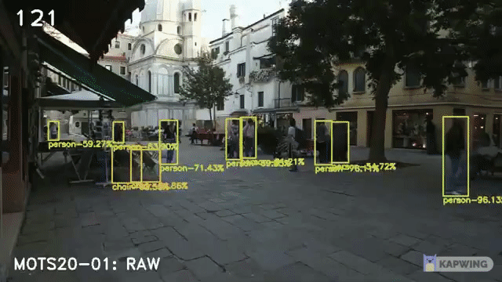
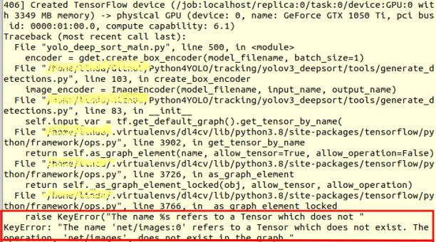

# YOLOv4 + Deep SORT with OpenCV.dnn
Raw data from Multiple Object Tracking Benchmark 
### MOT17-02-FRCNN[[link](https://motchallenge.net/vis/MOT17-02-FRCNN)]

[](https://youtu.be/mQXgsk38I7w)
## yolo_deep_sort_main.py
<div>
  usage: Detection and Tracking with OpenCV.dnn
  
  [-h] [--outputDir <O>] [--video <V>] --config
                                              <C> --weights <W> --classes <CL>
                                              [--confidence <CF>] [--use_gpu <U>]
</div>
<div>
optional arguments:
<ul>
  <li>
  -h, --help            show this help message and exit</li>

  <li>--outputDir <O>, -o <O>
                        path to the output directory of list files</li>
  <li>--video <V>, -v <V>   path to input Video</li>
  <li>--config <C>, -c <C>  path to yolo config file</li>
  <li>--weights <W>, -w <W>
                        path to yolo pre-trained weights</li>
  <li>--classes <CL>, -cl <CL>
                        path to text file containing class names</li>
  <li>--confidence <CF>, -cf <CF>
                        minimum probability to filter weak detections [default: 0.5]</li>
  <li>--use_gpu <U>, -u <U>
                        boolean indicating if CUDA GPU should be used</li>


</ul>         
</div>

## Getting started

#### 1. Requirements

```bash
python3
Tensorflow
OpenCV

# the others packages should be installed according to the messages shown on while executing this program 
```
#### 2. Deep SORT

reference to [theAIGuysCode/yolov3_deepsort](https://github.com/theAIGuysCode/yolov3_deepsort.git)
```bash
# change directory to tracking
cd tracking

git clone https://github.com/theAIGuysCode/yolov3_deepsort.git
```
#### 3. YOLOv4

```bash
You'd prepare your trained model by weights, config file, lasses names
```
In this article we will use those files from [AlexeyAB/darknet](https://github.com/AlexeyAB/darknet): yolov4.weights, yolov4.cfg, coco.names

## How to execute program

#### Command line

```bash
python3 yolo_deep_sort_main.py --weights yolov4.weights --config yolov4.cfg --classes coco.names --video MOT17-02-FRCNN-raw.webm
```

#### Fine tune

```bash
Error in 'net/images:0'
```

```bash
Try to change "net/%s:0" => "%s:0" 83 & 85 lines in 'yolov3_deepsort/tools/generate_detections.py'
```